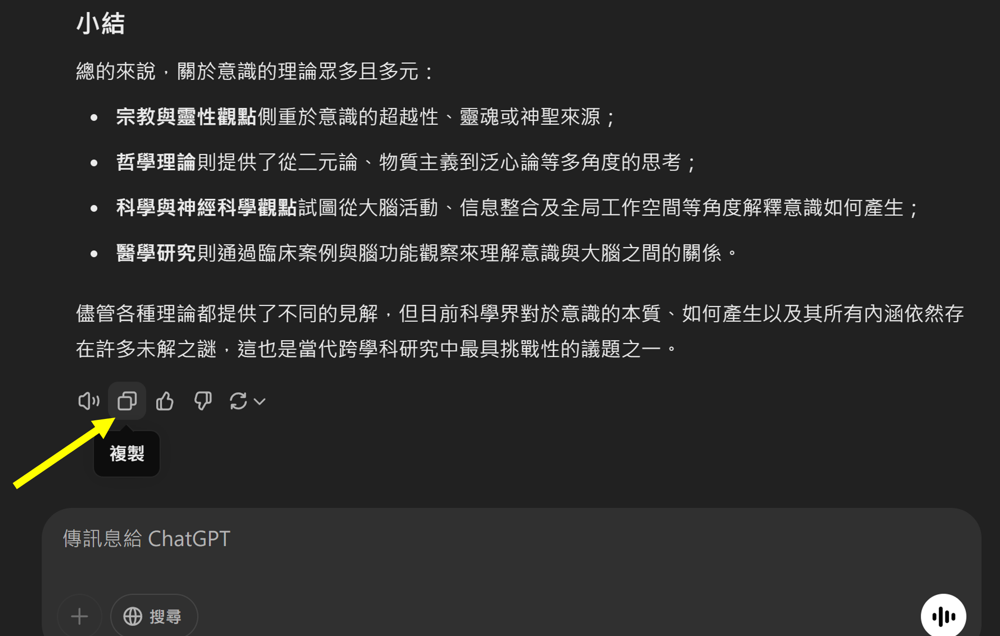
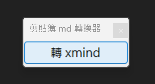
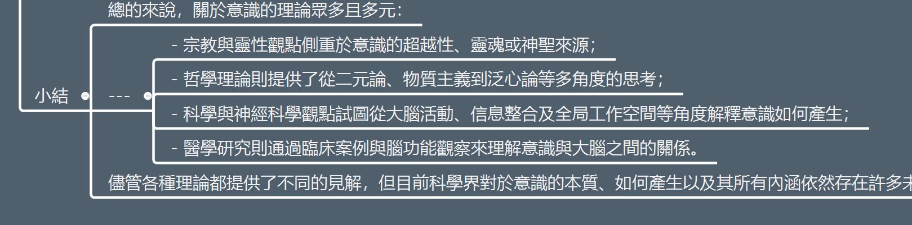
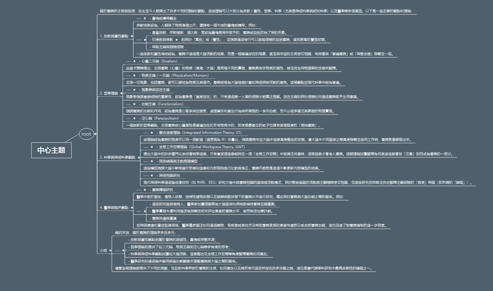
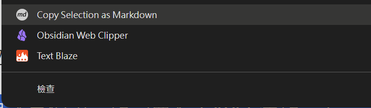

# Markdown to XMind 轉換工具

 
將多組 AI 對話或網頁內容轉換為 XMind 思維導圖，保留原有的階層結構，方便進行整理、頭腦風暴或團隊協作。
 

### 系統需求
- Windows 作業系統
- 已安裝 XMind 程式

### 下載安裝
- [下載最新版本 v1.2](https://github.com/j2023k/md_to_xmind/releases/download/v1.2/markdown_to_xmind_v1.2.zip)
- 綠色免安裝，解壓即用

## 💡 使用場景

### 1. AI 對話內容轉換
1. 在 AI 對話窗口中複製 Markdown 格式的內容
   

2. 點擊app,進行一鍵轉換
   

3. 在 XMind 中直接貼上 (Ctrl+V)
   
   

### 2. notebookLm 或是任意網頁內容的轉換
1. 使用 Chrome 擴展 [Copy as Markdown](https://chromewebstore.google.com/detail/copy-as-markdown/fkeaekngjflipcockcnpobkpbbfbhmdn)
2. 選擇網頁內容，右鍵選擇 "Copy selection as markdown"
   
    

## 🔄 工作流程
1. 複製 Markdown 格式內容
2. 使用工具一鍵轉換
3. 在 XMind 中貼上
4. 開始進行視覺化整理與協作

## �� 版本記錄
當前版本：v1.2

 